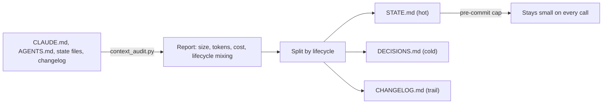

# Context Keep

Keep your context files lean, and stop them from growing back.

Context Keep is an open kit for a single problem: the files an AI reads on every call (`CLAUDE.md`, `AGENTS.md`, state files, changelogs) start small and useful, and months later they are large and mostly stale. You pay for that on every call.

It does two things. It **audits** those files for size, token cost per read, and whether one file is carrying more than one lifecycle. And it **guards** the size with a pre-commit cap, so the bloat you cleaned does not come back.

## Why this exists

In systems, you do not keep cold data in the hot path. RAM holds the working set; the archive lives on disk. Nobody loads the whole history into memory on every request.

Context files break that rule. They hold what is true now, why it was decided, and everything that ever changed, all in one file that loads on every call.

That costs twice. You pay input tokens for stale content on every read. And the model uses the middle of a long context worse than the ends, the effect the literature calls "lost in the middle", so a bloated file degrades the answer while it raises the bill.

> A changelog that grew to 140 KB is about 35,000 tokens reread on every commit. At a $5 / 1M input price, roughly 17 cents per commit to reread something nobody reads.

## How it flows



## Quick start

On Claude Code, install it as a plugin:

```
/plugin marketplace add macio-arruda/context-keep
/plugin install context-keep@context-engineering
```

The plugin ships two model-invoked skills: `audit-context` (check the files and report cost) and `guard-context` (install the cap and scaffold the layers).

Anywhere else, run the script directly:

```bash
python3 scripts/context_audit.py . --price-in 5 --reads 100
```

No dependencies beyond Python 3. Pass `--price-in` for your model's input price and `--reads` for a realistic session count, so the cost is concrete.

## See it before you try it

- [`examples/audit-report.md`](examples/audit-report.md) reads a bloated repo and shows what to cut.
- [`examples/before-after.md`](examples/before-after.md) takes one file that mixes three lifecycles and splits it into three.

## The three lifecycles

A context file should hold one of these, not several. Their rhythms are opposite, so mixing them forces the always-loaded file to carry weight it does not need.

| Layer | What it holds | Read rhythm |
|---|---|---|
| **State** | what is true now, the open items | every session |
| **Rationale** | why decisions were made | on demand |
| **Trail** | what changed and when | almost never |

The state is small and hot. The trail is append-only and grows without bound. Put them in one file and the file you load on every call grows forever.

## Two moves

**Split by lifecycle.** Each layer gets its own file, from [`templates/`](templates/). The state file points to the other two; it does not repeat them. The reasoning lives once, in `DECISIONS.md`, and everything links to it.

**Guard with a mechanism, not a rule.** The rule "keep it lean" is almost always already written, and ignored. A convention decays because nothing enforces it. The [`templates/pre-commit`](templates/pre-commit) cap warns near a soft limit and blocks past a hard one. The escape hatch (`git commit --no-verify`) should be rare enough that using it is a signal.

Full method: [`docs/method.md`](docs/method.md) · [`docs/pt-BR/metodo.md`](docs/pt-BR/metodo.md)

## What a well-kept context looks like

- The file loaded on every call is small, and a cap holds it there.
- State, rationale and trail each have one home, with the right read rhythm.
- The reasoning for a decision lives once; everything else links to it.
- The trail is terse and rolls to an archive; the hot path never carries the full history.
- Token cost per session is something you measured, not guessed.

## Repository structure

```
context-keep/
  README.md
  .claude-plugin/
    marketplace.json                 plugin catalog (Claude Code)
  plugins/
    context-keep/
      .claude-plugin/plugin.json
      skills/audit-context/SKILL.md
      skills/guard-context/SKILL.md
  scripts/
    context_audit.py                 size, token cost, lifecycle mixing
  templates/
    pre-commit                       the size cap
    STATE.md                         hot layer
    DECISIONS.md                     cold layer
    CHANGELOG.md                     trail layer
  docs/
    method.md
    references.md
    pt-BR/metodo.md
  examples/
    audit-report.md
    before-after.md
```

The repository is both the plugin and its marketplace. The marketplace is named `context-engineering`, so tools in the same line share one catalog.

## Positioning

> Context Keep keeps context files lean: it measures their token cost, finds the ones that mix lifecycles, and caps their size so bloat does not grow back.

Em português:

> O Context Keep mantém arquivos de contexto enxutos: mede o custo em token, acha os que misturam ciclos de vida, e trava o tamanho pra o inchaço não voltar.

## What this is not

- Not a summarizer or a compaction tool. It separates and caps; it does not rewrite your content.
- Not RAG or a vector store. This is the plain-file context you keep by hand.
- Not automatic. The audit is a report and the split is your call. Only the cap runs on its own.

## Status

Early version, used daily. Interfaces may change. Issues and pull requests welcome.

Known gaps, listed on purpose:

- Token counts are estimates (bytes over a chars-per-token divisor). For exact numbers, use your model's tokenizer or count_tokens endpoint. The cost figure is only as good as the price you pass in.
- Lifecycle detection is heuristic (keyword and header matching, English and Portuguese). It flags likely mixing; it does not prove it. Read the file before you split.
- The pre-commit cap measures size, not quality. A small file can still be badly organized.

## About

Personal project, maintained in my own time. It does not represent any organization.

MIT licensed.
